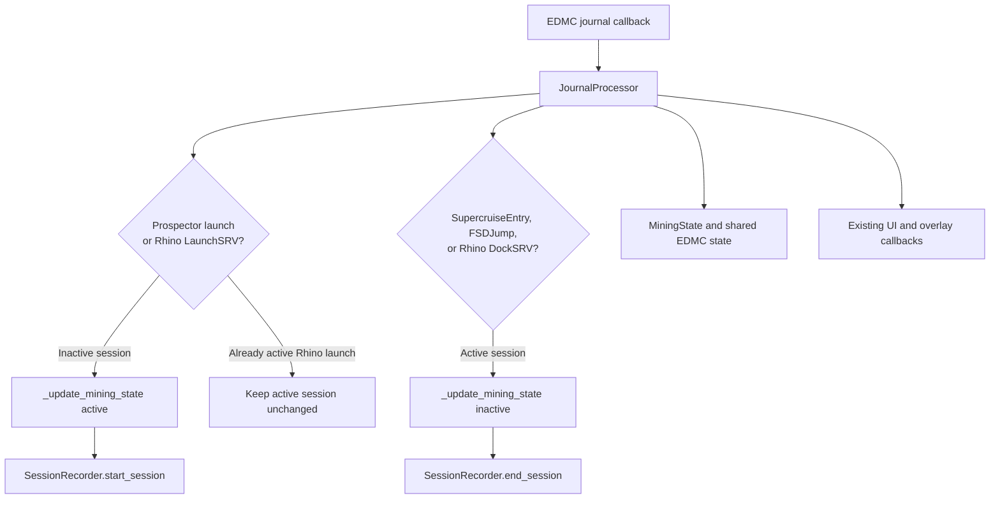

# Rhino Surface-Mining Session Boundaries

## Overview

EDMC Mining Analytics will recognize surface-mining sessions performed in an SRV Rhino. A Rhino session begins when the game journal emits `LaunchSRV` with `SRVType` `mev_rhino`, and ends when it emits a matching-type `DockSRV` event.

The feature extends the existing single mining-session state machine. It does not create a parallel session model because a player cannot conduct asteroid mining and Rhino surface mining at the same time.

## Detailed Requirements

1. A `LaunchSRV` event whose `SRVType`, after case-insensitive normalization, is `mev_rhino` starts mining when no mining session is active.
2. A `DockSRV` event with normalized `SRVType` `mev_rhino` ends an active mining session.
3. A non-Rhino `LaunchSRV` or `DockSRV` must not alter mining-session state.
4. Existing asteroid mining behavior remains unchanged:
   - a Prospector `LaunchDrone` starts a session;
   - `SupercruiseEntry` or `FSDJump` ends an active session.
5. A repeated Rhino launch while an active mining session exists continues the current session. It must not reset counters, timestamps, or session-recorder data.
6. A `SupercruiseEntry` ends the active session using the existing path. Consequently, the next Rhino launch starts a fresh session.
7. Session records and logs use a clear reason: `Rhino SRV launched` on start and `Rhino SRV docked` on stop.
8. The feature must work when `LaunchSRV` has no system or body fields. Existing state and journal context remain the source of location metadata.
9. Planetary Mining Location signals are not new session boundaries. A valid, approach-scoped `Touchdown` at a Planetary Mining Location carries the current body's signal index as Rhino session location metadata.

## Architecture Overview



## Components and Interfaces

### Journal event dispatcher

Extend the journal event dispatcher with two explicit branches:

- `LaunchSRV` delegates to a Rhino-launch handler.
- `DockSRV` delegates to a Rhino-dock handler.

The branches normalize `SRVType` defensively: absent, non-string, blank, or non-Rhino values are ignored. This keeps journal compatibility for other SRVs and malformed events.

### Rhino-launch handler

The handler receives the journal entry, EDMC shared state, and parsed event time.

When the entry is Rhino and `is_mining` is false, it calls the established state-transition method with `active=True` and `Rhino SRV launched`. That method remains responsible for resetting session counters, setting timestamps, resolving available location/ship/capacity data, starting the recorder, and scheduling UI updates.

When the entry is Rhino and `is_mining` is true, the handler performs no transition. This implements continuation after a duplicate launch with no preceding supercruise entry.

### Rhino-dock handler

When the entry is Rhino and `is_mining` is true, the handler calls the established state-transition method with `active=False` and `Rhino SRV docked`. Existing finalization remains responsible for the end timestamp, recorder export, optional Discord summary, UI cleanup, and refresh callbacks.

An inactive session or a non-Rhino dock is a no-op.

### Existing state and recorder

No `session_kind`, SRV ID, or parallel state is added. The existing `is_mining`, start/end timestamps, mining counters, session recorder, and shared-state publication are sufficient under the stated mutual-exclusivity rule.

For surface sessions, journal processing retains an approach-scoped touchdown candidate when `NearestDestination` encodes a Planetary Mining Location index. The next Rhino launch uses that body as its location fallback and stores the positive index separately from the body name. The session recorder writes the derived label, `Planetary Mining Location Signal (N)`, inside `meta.location`. Candidates expire on `SupercruiseEntry` and `FSDJump`; a touchdown never starts or stops mining.

## Data Models

No persistent data-model migration is required.

The existing mining state continues to expose:

- active/inactive session state;
- start and end timestamps;
- cargo, material, prospecting, and rate metrics;
- available location, system, ship, and capacity metadata.

The session recorder's existing start/stop reason field distinguishes Rhino sessions from asteroid sessions without changing its JSON schema.

## Error Handling

- Ignore malformed `LaunchSRV` and `DockSRV` entries without raising or changing state.
- Ignore unsupported SRV types.
- Treat a repeated Rhino launch during an active session as an idempotent continuation.
- Continue using the existing journal timestamp fallback to current UTC time when the journal timestamp is absent or invalid.
- Preserve existing logging and exception-reporting paths; no raw `print` calls.

## Testing Strategy

Write tests with the production event order and injected callbacks used by the existing journal tests.

Unit coverage must prove:

- Rhino launch starts an inactive session, sets the journal timestamp, and invokes the session-start callback/recorder with the Rhino reason.
- Rhino dock ends an active session, sets the end timestamp, and invokes the session-end callback/recorder with the Rhino reason.
- Non-Rhino launch and dock are ignored.
- A repeated Rhino launch leaves the existing start timestamp, counters, and recorder session intact.
- A supercruise entry ends the active Rhino session; a later Rhino launch starts a new one.
- Existing Prospector start and supercruise/FSD stop tests remain green.

Harness coverage must replay a Rhino `LaunchSRV`/`DockSRV` sequence through the EDMC callback shim and assert the public shared state transitions from active to inactive. It must also verify no regression for normal Prospector sessions.

Required verification commands after implementation:

```bash
source .venv/bin/activate && python -m pytest tests/test_journal_simulation.py
source .venv/bin/activate && python -m pytest tests/test_harness_integration.py -k 'rhino or session'
source .venv/bin/activate && python -m pytest
```

## Appendices

### Technology choices

The design reuses the existing journal processor and state-transition API. This minimizes behavioral drift, keeps UI work on the established callback path, and avoids duplicate session-recording logic.

### Research findings

The supplied journal log contains Rhino events with `SRVType` `mev_rhino` and localized value `SRV Rhino`. It also contains unmatched launch/dock records, motivating the explicit duplicate-launch continuation rule.

Planetary Mining Location signals appear in `FSSBodySignals` and `SAASignalsFound` records. A Rhino launch lacks system and body fields, so such records may provide context, but they are deliberately outside this feature's boundary contract.

### Alternatives considered

**Separate Rhino session state:** Rejected because session types are mutually exclusive and a second state machine would increase synchronization and shutdown risk.

**Store SRV ID and session kind:** Rejected for this scope. Type-based boundary events and one active-session flag satisfy the stated rule. IDs can be added later if EDMC introduces concurrent or ambiguous SRV behavior.

**Use Planetary Mining Location as a start signal:** Rejected because scanning a site does not mean a player started mining.
